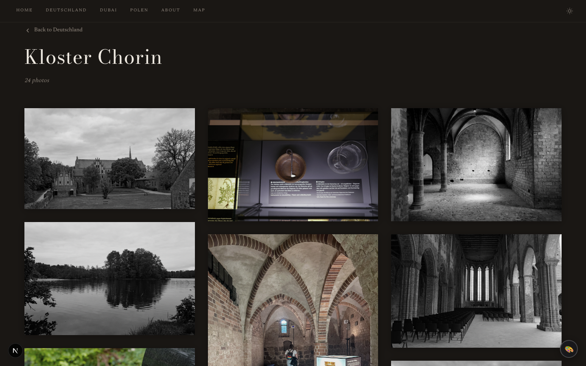

# Immich Folio

A self-hosted photography portfolio powered by [Immich](https://immich.app). Turns your Immich albums into a beautiful, public-facing gallery — without ever exposing your Immich server to the internet.

Immich Folio acts as a **secure reverse proxy** between your visitors and your private Immich instance. Your Immich server stays on your local network, completely invisible to the outside world.

<p align="center">
  
  
</p>

## Features

### Gallery & Layout

- **Configurable hero layouts** — split, fullbleed, minimal, stacked (image + thumbnail strip), typographic (text-only), or mosaic (multi-image grid)
- **Hero image carousel** — single image or crossfade carousel of multiple Immich assets
- **Masonry photo grid** — responsive layout with natural aspect ratios and configurable columns, gap, and aspect ratio
- **Uniform grid mode** — switch to a fixed-aspect uniform grid per-subpage or globally
- **Showcase / filmstrip / editorial-flow layouts** — featured hero + grid, horizontal scroll strips, or alternating full-width and paired images
- **Per-subpage grid overrides** — each subpage can define its own columns, gap, aspect ratio, and layout mode
- **Fullscreen lightbox** — keyboard and swipe navigation, EXIF panel, adjacent image preloading
- **EXIF metadata on hover** — camera body, lens, focal length, aperture, shutter speed, ISO shown directly on the grid
- **ThumbHash placeholders** — instant blurred previews while full images load

### Content & Organization

- **Subpage grouping** — organize albums into named collections (e.g. `/japan/tokyo-2023`)
- **Auto-generated slugs** — URL slugs derived from album names automatically
- **YAML gallery config** — all gallery structure defined in a single `content/gallery.yaml` file
- **Markdown about page** — `content/about.md` with frontmatter for portrait, name, location, and gear list
- **Dynamic OG images** — auto-generated social preview images per album

<details>
<summary><strong>Security &amp; Infrastructure</strong></summary>

<br>

| Concern | Protection |
| --- | --- |
| **Server exposure** | Immich URL never leaves your network — all requests proxy server-side |
| **API key** | Stored only in `.env.local`, never in client code |
| **Asset IDs** | Immich UUIDs encrypted (AES-256) into opaque tokens |
| **Album scope** | Only albums in `gallery.yaml` are accessible |
| **Password protection** | Per-subpage password support |
| **Rate limiting** | Per-IP sliding-window rate limiter (configurable RPM) |

- Health check endpoint at `GET /api/health`
- In-memory caching with configurable TTL
- Standalone Docker image — multi-stage, non-root, ~150 MB

</details>

## Quick Start

```bash
# Clone and install
git clone https://github.com/ralksta/immich-folio.git
cd immich-folio
npm install

# Configure
cp .env.local.example .env.local
# Edit .env.local with your Immich server URL and API key

cp content/gallery.yaml.example content/gallery.yaml
# Edit gallery.yaml with your album UUIDs

# Run
npm run dev
```

## Configuration

### Environment Variables (`.env.local`)

```env
# Required
IMMICH_API_URL=http://your-immich-server:2283
IMMICH_API_KEY=your-api-key

# Optional
SITE_TITLE=My Photography            # default: "Gallery"
SITE_SUBTITLE=A visual journal        # default: empty
CACHE_TTL=300                          # seconds, default: 300
RATE_LIMIT_RPM=120                     # requests/min/IP, default: 120
```

### Gallery Config

All gallery structure — hero images, albums, subpages, grid layout, footer — is defined in `content/gallery.yaml`.

→ **[Gallery Configuration Guide](docs/gallery-config.md)**

### Theming

Six built-in presets with distinct visual identities — or mix and match with fine-grained control over colors, fonts, corners, photo frames, hero layout, and grid style.

```yaml
theme: studio # or: minimal, editorial, classic, noir, monograph
```

→ **[View all Themes & Configuration Guide](docs/theming.md)**

## Docker

### Docker Compose (recommended)

```yaml
services:
  lightbox:
    build: .
    container_name: immich-folio
    restart: unless-stopped
    ports:
      - '7211:7211'
    env_file:
      - .env.local
    volumes:
      - ./content:/app/content:ro
```

Run with:

```bash
docker compose up -d
```

The gallery will be available at `http://localhost:7211`.

<details>
<summary><strong>Advanced Docker (Standalone, Health Check, Proxy)</strong></summary>

### Standalone Docker

```bash
# Build
docker build -t immich-folio .

# Run
docker run -d \
  --name immich-folio \
  --restart unless-stopped \
  -p 7211:7211 \
  --env-file .env.local \
  -v ./content:/app/content:ro \
  immich-folio
```

> **Note:** The `content/` volume mount lets you update `gallery.yaml` and `about.md` without rebuilding the image.

### Health Check

The container includes a built-in health check at `/api/health`:

```bash
curl http://localhost:7211/api/health
```

### Reverse Proxy

Put Immich Folio behind nginx / Caddy / Traefik with TLS. Example Caddy config:

```
photos.example.com {
    reverse_proxy localhost:7211
}
```

</details>

## Tech Stack

- **Next.js 16** (App Router, standalone output)
- **React 19**
- **TypeScript**
- **Vanilla CSS** (no framework)

## License

MIT License — free to use and modify for the Immich community.
