# Theming

Control the visual identity of your gallery from `content/gallery.yaml`. Choose a built-in preset or customize individual properties — no CSS editing required.

## Quick Start

Add a single line to your `gallery.yaml`:

```yaml
theme: minimal
```

That's it. Your entire gallery switches to the minimal theme.

## Built-in Presets

| Preset        | Style                          | Accent       | Fonts                              | Hero        | Frame        | Grain |
| ------------- | ------------------------------ | ------------ | ---------------------------------- | ----------- | ------------ | ----- |
| **studio**    | Leica-inspired, editorial      | 🔴 `#e60012` | Playfair Display + DM Sans         | Split       | Passepartout | ✓     |
| **minimal**   | Swiss brutalist, high contrast | ⚫ `#000000` | Geist + IBM Plex Mono              | Fullbleed   | None         | ✗     |
| **editorial** | Cinematic magazine, warm tones | 🟤 `#8B2500` | Bodoni Moda + Newsreader           | Split       | Shadow       | ✗     |
| **classic**   | Gilded gallery, warm luxury    | 🟡 `#c49a3c` | Cinzel + Crimson Pro               | Minimal     | Passepartout | ✗     |
| **noir**      | Darkroom analog, film noir     | 🟠 `#ff6b35` | Libre Baskerville + Source Sans 3  | Fullbleed   | Passepartout | ✓     |
| **monograph** | Typographic, book-like         | ⬛ `#333333` | Instrument Serif + Inter           | Typographic | None         | ✗     |
| **botanica**  | Organic, nature-inspired       | 🟢 `#4a7c59` | Cormorant Garamond + Nunito Sans   | Split       | None         | ✗     |

Default is `studio` if no theme is specified.

<table>
  <tr>
    <td align="center"><strong>Studio</strong><br><em>Leica-inspired, red dot</em></td>
    <td align="center"><strong>Minimal</strong><br><em>Swiss brutalist, fullbleed hero</em></td>
  </tr>
  <tr>
    <td></td>
    <td>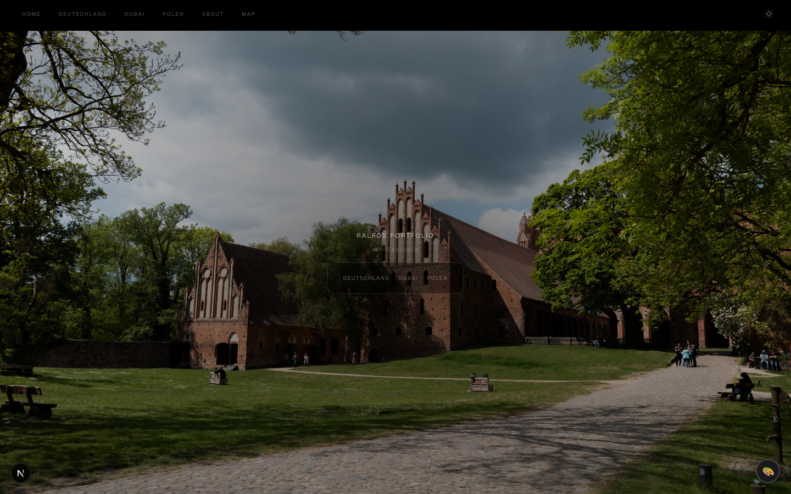</td>
  </tr>
  <tr>
    <td align="center"><strong>Editorial</strong><br><em>Cinematic magazine, warm charcoal</em></td>
    <td align="center"><strong>Classic</strong><br><em>Gilded gallery, gold accents</em></td>
  </tr>
  <tr>
    <td></td>
    <td>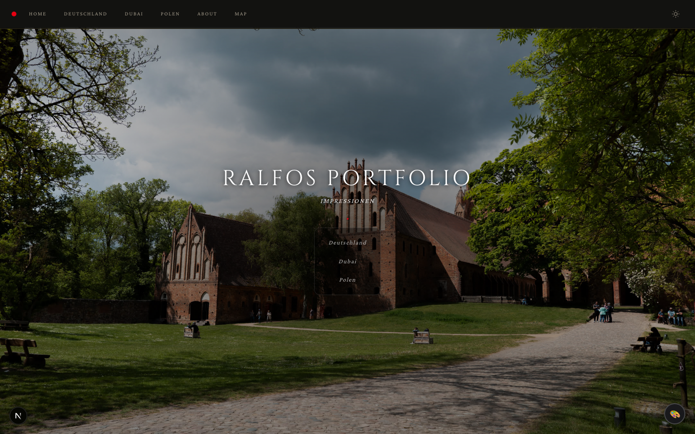</td>
  </tr>
  <tr>
    <td align="center"><strong>Noir</strong><br><em>Darkroom analog, film noir</em></td>
    <td align="center"><strong>Monograph</strong><br><em>Typographic, book-like</em></td>
  </tr>
  <tr>
    <td>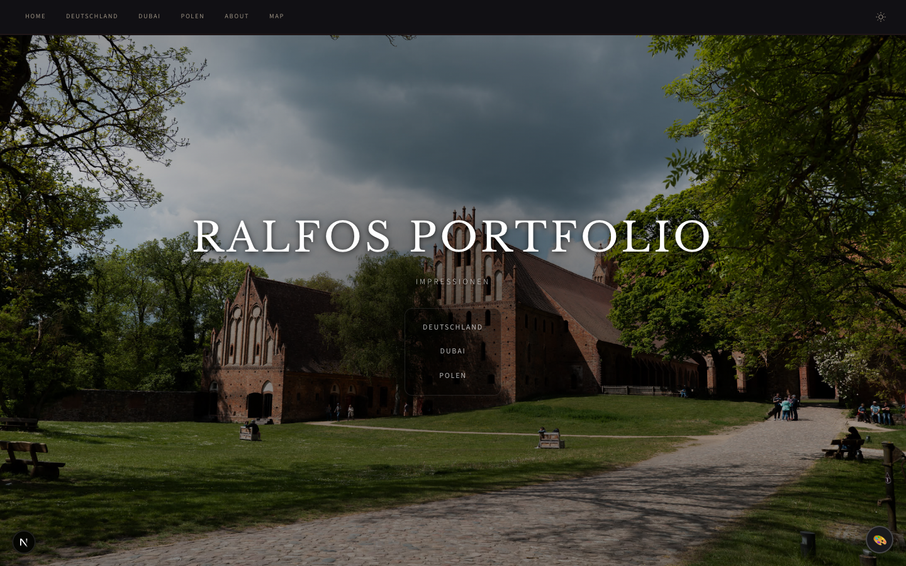</td>
    <td>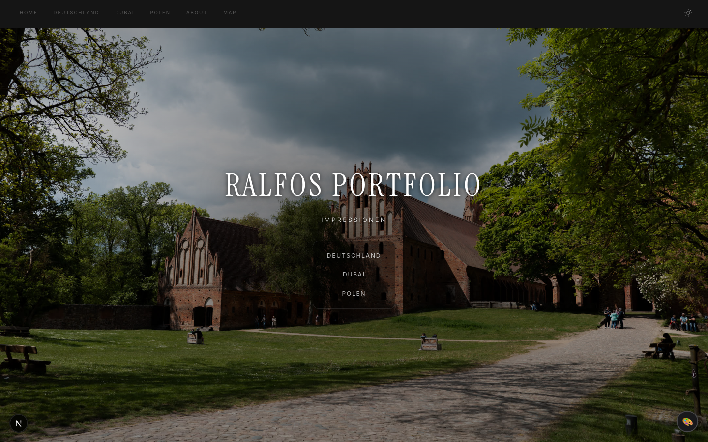</td>
  </tr>
  <tr>
    <td align="center"><strong>Botanica</strong><br><em>Organic, nature-inspired</em></td>
    <td></td>
  </tr>
  <tr>
    <td>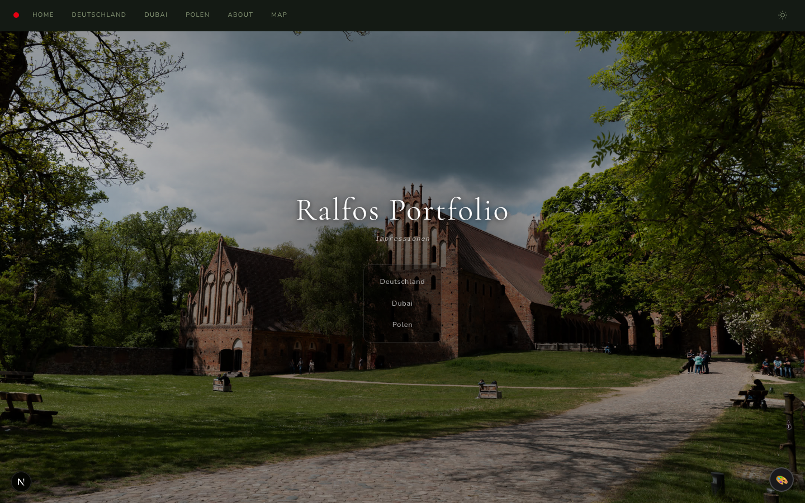</td>
    <td></td>
  </tr>
</table>

### What makes each theme unique

**Studio** (default) — Leica-inspired with a red nav dot, passepartout photo frames, film grain, and a split hero layout. Clean editorial feel with Playfair Display headings.

**Minimal** — Swiss Brutalist aesthetic inspired by Müller-Brockmann and Dieter Rams. Fullbleed hero image, true black/white palette, zero-gap photo grid with no hover effects, ultra-tiny navigation text. Every pixel earns its place.

**Editorial** — Cinematic magazine feel inspired by Aperture and Magnum Photos. Oversized Bodoni Moda serif titles, warm charcoal backgrounds, generous grid spacing, slow cinematic transitions with desaturation-on-idle photos, and pull-quote section labels.

**Classic** — Fine art gallery aesthetic with warm gold accents, Cinzel Roman capitals for headings, decorative ornamental dividers, warm passepartout frames, rounded corners, and an elegant gold header dot. Feels like a luxury exhibition catalog.

**Noir** — Darkroom analog aesthetic with warm amber accents on a deep cool-black base. Sepia-tinted photos with vignette hover effects, film-edge EXIF labels in monospace, and a grain overlay. Inspired by wet-plate photography and film noir cinematography.

**Monograph** — Type-first book design with no hero image. Features an 8rem serif title, numbered photo indices via CSS counters, slide-up EXIF captions, hairline dividers, and generous whitespace. Feels like an artist monograph.

**Botanica** — Organic, nature-inspired with forest green accents and warm linen backgrounds. Rounded corners, botanical ornament dividers (❧), italic captions, and gentle hover animations. Feels like a botanical field guide.

## Custom Theme

Start from any preset and override individual properties:

```yaml
theme:
  preset: studio # base preset to extend (default: studio)
  accent: '#2563eb' # brand/accent color (any hex)
  fonts:
    heading: 'Inter' # Google Fonts name for headings
    body: 'Inter' # body text
    caption: 'JetBrains Mono' # EXIF captions
  radius: 8 # border-radius in px (0 = sharp corners)
  photoFrame: none # "none" | "passepartout" | "shadow"
  grain: false # film grain overlay on photos
  headerDot: false # accent-colored dot in the nav bar
  heroStyle: split # "split" | "fullbleed" | "minimal" | "stacked" | "typographic" | "mosaic"
```

All properties are optional — omitted values fall back to the preset defaults.

## Properties Reference

### `accent`

The brand color used for hover effects, navigation highlights, the header dot, and OG social preview images.

### `fonts`

Google Fonts names. Fonts are loaded automatically — just use the name as it appears on [fonts.google.com](https://fonts.google.com). Three font slots:

- **heading** — album titles, hero title, section labels
- **body** — navigation, descriptions, UI text
- **caption** — EXIF metadata, photo captions

### `radius`

Border radius in pixels applied to photo grid items and album cards:

- `0` — sharp, editorial corners
- `4-8` — subtle rounding
- `12+` — soft, modern feel

### `photoFrame`

How photos are framed in the grid:

- **`none`** — photos fill the grid cell directly
- **`passepartout`** — museum-style mat border around each photo with print-style EXIF captions below
- **`shadow`** — subtle drop shadow behind each photo

### `grain`

When `true`, a subtle film grain texture overlays each photo in the grid. Adds an analog, filmic character.

### `headerDot`

When `true`, shows a small accent-colored dot in the navigation bar (inspired by the Leica red dot).

### `heroStyle`

Controls the homepage hero layout:

- **`split`** — title/nav on the left, hero image on the right (used by Studio, Editorial, Botanica)
- **`fullbleed`** — hero image fills the entire viewport, title overlaid in the corner (used by Minimal, Noir)
- **`minimal`** — centered title card with decorative ornament, hero image as a banner below (used by Classic)
- **`stacked`** — full-viewport hero image with title gradient-overlaid at the bottom, horizontal thumbnail navigation strip below
- **`typographic`** — no hero image; massive centered title with numbered album navigation list (used by Monograph)
- **`mosaic`** — asymmetric multi-image grid with frosted-glass title overlay centered on top

<table>
  <tr>
    <td align="center"><strong>Split</strong></td>
    <td align="center"><strong>Fullbleed</strong></td>
    <td align="center"><strong>Minimal</strong></td>
  </tr>
  <tr>
    <td>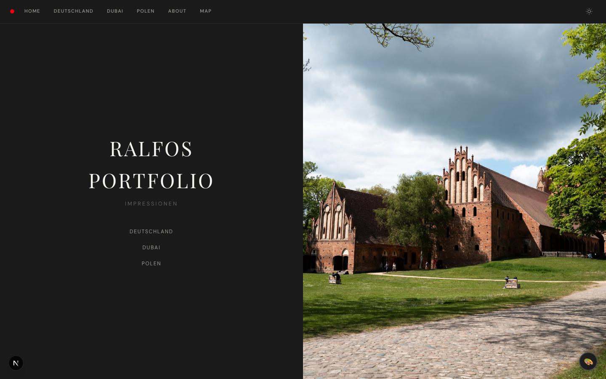</td>
    <td>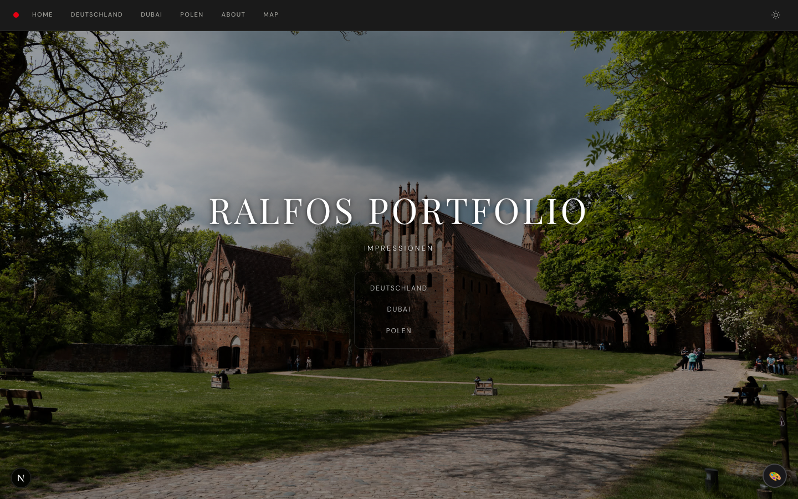</td>
    <td>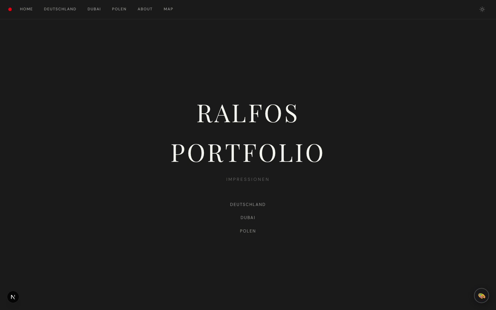</td>
  </tr>
  <tr>
    <td align="center"><strong>Stacked</strong></td>
    <td align="center"><strong>Typographic</strong></td>
    <td align="center"><strong>Mosaic</strong></td>
  </tr>
  <tr>
    <td>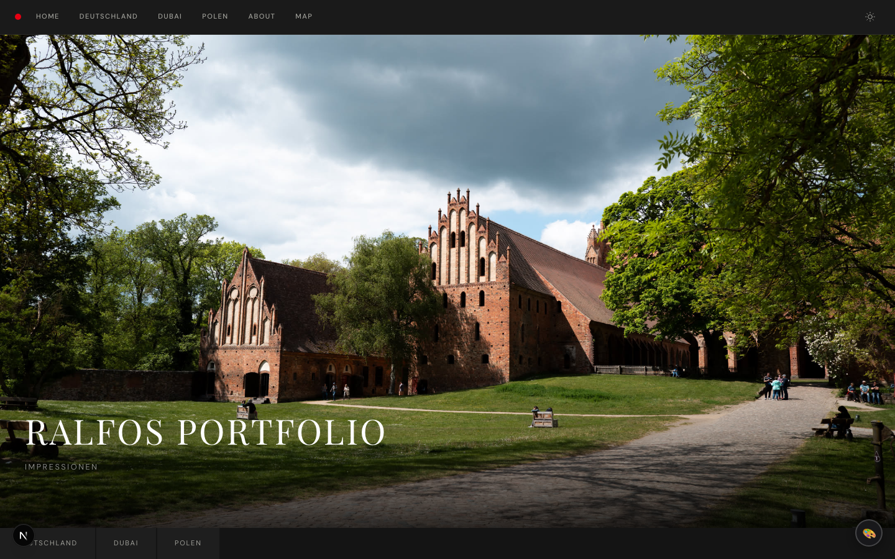</td>
    <td>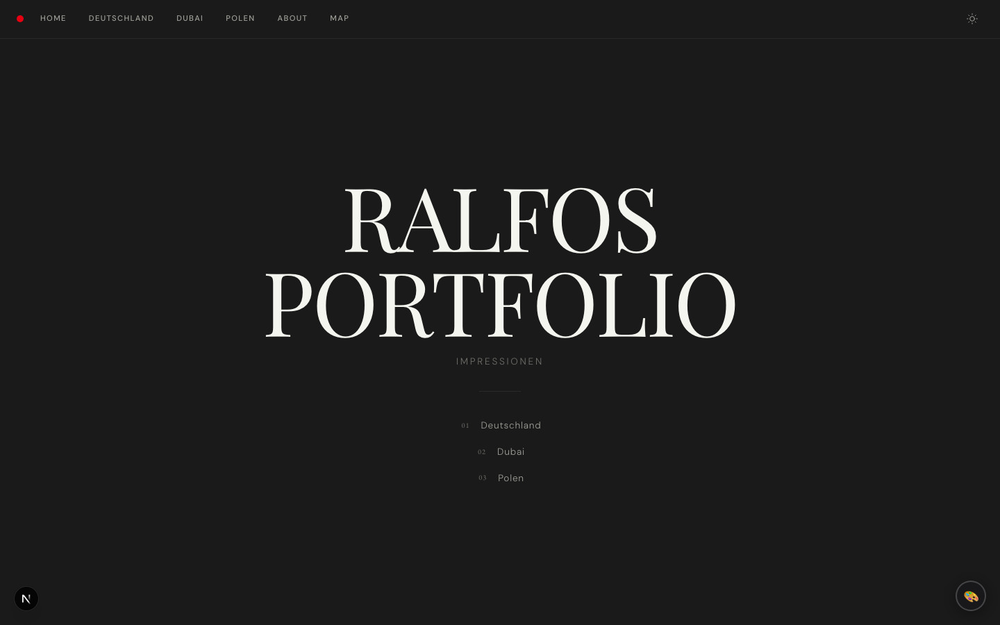</td>
    <td>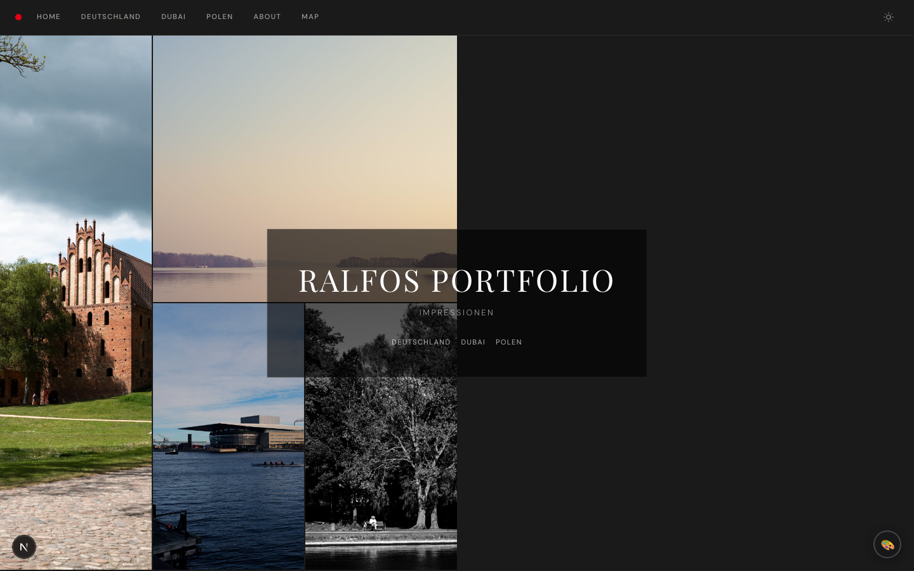</td>
  </tr>
</table>

### `grid.layout`

Controls the photo grid layout on album pages:

- **`masonry`** — Pinterest-style stacked columns, images shown at natural aspect ratios (default)
- **`uniform`** — CSS Grid with fixed aspect ratio cells
- **`showcase`** — first image displayed at full width (16:9), rest in standard grid
- **`filmstrip`** — horizontal scroll of tall vertical image strips with scroll snapping
- **`editorial-flow`** — alternating full-width (21:9) and side-by-side (4:3) image pairs

## Examples

### Minimal portfolio

```yaml
theme:
  preset: minimal
  accent: '#0066cc'
  fonts:
    heading: 'Outfit'
    body: 'Outfit'
```

### Film photography blog

```yaml
theme:
  preset: studio
  accent: '#d4a017'
  grain: true
  photoFrame: passepartout
```

### Modern magazine

```yaml
theme:
  preset: editorial
  radius: 12
  fonts:
    heading: 'Fraunces'
    body: 'Inter'
    caption: 'IBM Plex Mono'
```

### Luxury gallery

```yaml
theme:
  preset: classic
  accent: '#b8860b'
  fonts:
    heading: 'Playfair Display'
    body: 'Lora'
```

### Dark analog portfolio

```yaml
theme:
  preset: noir
  heroStyle: stacked
```

### Type-forward monograph

```yaml
theme:
  preset: monograph
  accent: '#444'
  fonts:
    heading: 'DM Serif Text'
```

### Nature / travel journal

```yaml
theme:
  preset: botanica
  heroStyle: mosaic
grid:
  layout: editorial-flow
```
